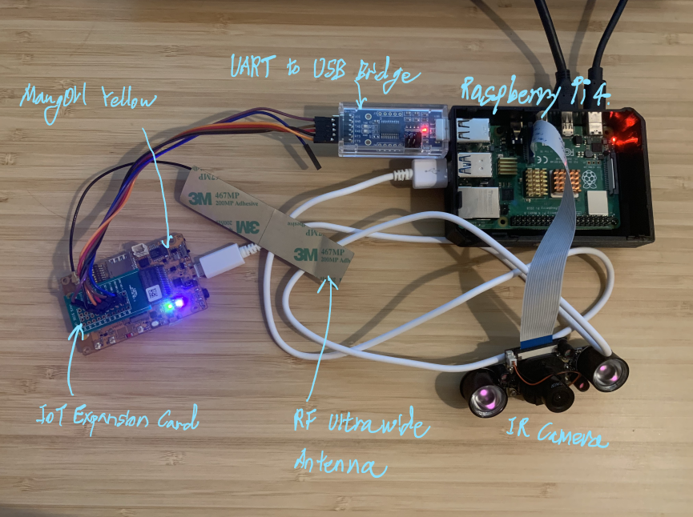

# VPS(Vison Processing System) for Capstone Project

## Goal
For our Capstone Project, Monitoring Unoccupied Property(MUP), our client, SierraWireless provided MangOH Yellow IoT board that has various sensors. However, it does not have a camera module. Yet detecting human intrusion would be a valueable asset as a monitoring device. Therefore we purchased a Raspberry Pi and an external camera which create the Vision Processing System(VPS).

## Hardware
Below is the visual of the VPS(Raspberry Pi + Camera) integrated with the rest of the hardware.

   

The VPS connects to the mangOH Yellow by a UART-to-USB bridge (FT232RL), to establish serial communication. The method of UART is chosen because of one-to-one connection and its simplicity.

## Object Detection
The VPS utilizes the Raspberry Pi 4B and an exteranl Pi's camera and takes pictures whenever a human
is detected. Then the image file gets converted into a binary data so that the can be sent through the UART serial connection. 

<b>File:</b> asset/Object_Detection.py   
<b>Framework & Library used</b>: Tensorflow Lite, Open CV   

<b>Object Detection Algorithm</b>: Custom Tensor Flow Lite object detection derived from https://github.com/EdjeElectronics/TensorFlow-Lite-Object-Detection-on-Android-and-Raspberry-Pi  

<b>Main Feature</b>: 
In Object_Detection.py file, once an object is identified as a person with the high confidence level,
<pre><code>if object_name == 'person' and int(scores[i]*100) >60 :
</pre></code>

It captures the image and convert into to a .jpg file. 
<pre><code>image=videostream.read()

retval, buffer =cv2.imencode('.jpg',image)</code></pre>

And then, the image is converted to the base64 binary string. 
<pre><code>jpg_as_text = base64.b64encode(buffer)</code></pre>
Octave does not accept the image file itself, but it accepts a binary string. Therefore, the conversion is nesseary. Encoded strings can be decoded in the Google's Firebase backend later.

## File Transmission
The base64 binary data will be sent to the mangOH. Using celluar data, mangOH uploads the data to Octave periodically. Octave is the platform by Sierra Wireless that ensures the secure data transmission form the IoT device to the Firebase cloud platform. Sierra wireless provides the Octave-resource-protocol(ORP) which can be found on https://docs.octave.dev/docs/octave-resource-protocol-guides   
<b>File:</b> edge/orp_transmission.py   
<b>Main Feature</b>:

The orp_transmission.py constantly checks the status of the binary data that is convered from .jpg file.
<pre><code>status=os.stat(path)</pre></code>

It checks if the binary data's last updated time, and if there is a new file, it opnes the file and read the data
<pre><code>while (previous_time != status.st_mtime_ns):
           previous_time=status.st_mtime_ns

           read_file = open (path, 'r')
           data = read_file.read()
</pre></code>

After reading the file, type string vps_shot(binary file) will be encoded and send to Octave using the ORP protocol.
<pre><code>request = 'push str vps_shot 0 {0}'.format(data)
encode_and_send(request)
</pre></code>

After sending it, it doesn't send any new file for next 30 seconds at least. This is due to the limitation of the UART. 
Sending the binary data size of 72kB (which is the image size of 256x144) to the Octave takes up to 5 seconds . To prevent consecutive data input being jammed and lost, I have set 30 seconds threshold wait time.
<pre><code>sleep(30)
print("waiting for new base64 string...") 
</pre></code>

## Video
Completed Product's video link can be found on https://youtu.be/C5yVolmsEAE
